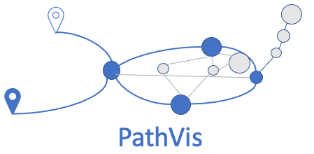

## What is PathVis?

In three words: *PathVis visualises traceroutes*.

To elaborate a bit more:
Pathvis is a traceroute visualiser prototype.
It retrieves all open TCP connections from your computer and runs traceroutes to each remote endpoint.
PathVis enriches each hop encountered in the traceroutes with data from e.g. WHOIS and DNS.
When a route changes (e.g., in case of a brand new trace, or a new hop appears in the trace), PathVis publishes the enriched change to a WebSocket. 
PathVis comes with both a graphical web interface which visualises the traceroutes in a graph (found in `webui/`), as well as a simple command line client (`ws_client.py`).

## Preparing PathVis

Before you can run PathVis, you need to install some dependencies as described below.
The instructions assume a Debian-based system
(but PathVis should work on most Linux- and UNIX-based systems).

```
$ sudo apt-get install build-essential python3-all-dev python3-venv traceroute
$ sudo apt-get install nodejs npm yarnpkg		# for the web UI
$ python3 -m venv venv
$ ./venv/bin/python3 -m pip install -r requirements.txt
```

## Running PathVis

First start the tool that collects and distributes traceroute information:
```
$ ./venv/bin/python3 ./path_traceroute.py
```

Then, either start the web interface (launches on localhost:8080):
```
$ cd webui/
$ yarnpkg install
$ yarnpkg start
```
Or start the CLI client:
```
$ ./venv/bin/python3 ws_client.py
```

## Running PathVis with dnsmasq

Use these instructions if you'd like to see the domain names that were used up to look up an IP address (instead of seeing just the reverse name for an IP address).

First, start dnsmasq as follows:
```
$ sudo dnsmasq -S 9.9.9.9 --no-daemon --log-queries=extra --log-facility=/tmp/query.log
```
Then make sure you tweak `/etc/resolv.conf` such that dnsmasq is actually used by your system to look up names (for example by adding `nameserver 127.0.0.1` at the top of `/etc/resolv.conf`).
You may need to temporarily turn off a local resolving service that's already running on your system to free up port 53 on localhost, e.g. if you're using systemd-resolved.
Finally, follow the instructions in the *Running PathVis* section; make sure to start `path_traceroute.py` with the following arguments: `-Q /tmp/query.log`.

## Security considerations

PathVis is designed to run on localhost only.
Opening it up on LAN or WAN interfaces introduces security and privacy issues.
If this is your goal, at least consider securing it using a reverse proxy such as nginx.

## Feedback welcome

Since PathVis is a prototype, we expect that things may break.
We would love to hear your feedback!
Email us at sidnlabs@sidn.nl or create an issue in this GitHub repository.

